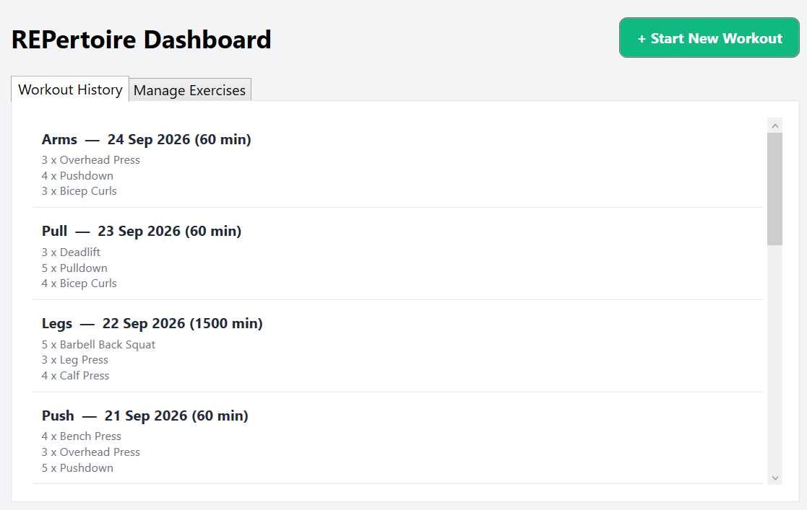

# REPertoire 🏋️‍♂️

A desktop workout tracker built to make logging gym sessions easy. It lets you create workouts, add exercises on the fly, and track your weights and reps in real-time.

## 🛠️ Built With
* **C# and WPF:** Used to write the logic and build the user interface of the desktop app.
* **Microsoft SQL Server:** The database used to save and organize all the workout data.

## ✨ Features
* **Live Workout Tracking:** Start a session and log sets (weight and reps) for different exercises.
* **Quick Add:** Add new exercises to the database directly from the active workout screen without losing your place.
* **Workout History:** A dashboard that shows past workouts, how long they took, and a quick summary of the exercises completed.
* **Secure Data Saving:** Uses parameterized SQL queries to safely send user input to the database.

## 🗄️ How the Database Works
The app saves data using three simple tables:
1. **Sessions:** Tracks when a workout starts and ends.
2. **Exercises:** A list of the different gym movements (like Bench Press or Squat).
3. **Sets:** Links the exact weight and reps you lifted to a specific session and exercise.