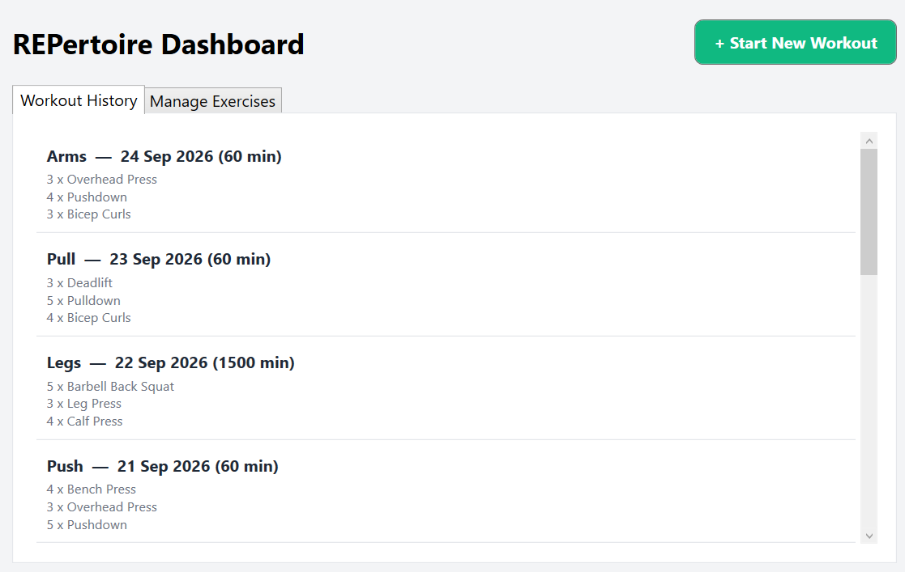

# REPertoire

A desktop workout tracker built to make logging gym sessions easy. It lets you create workouts, add exercises on the fly, and track your weights and reps in real-time.

## Tech Stack
* **Front-End:** C# and WPF (Windows Presentation Foundation) for the desktop interface.
* **Database:** Microsoft Azure SQL Database for cloud storage.

## Features
* **Live Workout Tracking:** Start a session and log sets for different exercises.
* **Quick Add:** Add new exercises to the database directly from the active workout screen.
* **Workout History:** A dashboard that shows past workouts, how long they took, and a quick summary.
* **Cloud Connected:** Data is saved directly to Azure, meaning the app runs without needing a local SQL Server installed.

## How the Database Works
The app saves data using three simple tables:
1. **Sessions:** Tracks when a workout starts and ends.
2. **Exercises:** A list of the different gym movements (like Bench Press or Squat).
3. **Sets:** Links the exact weight and reps you lifted to a specific session and exercise.

## Live Demo
You can try the app without installing any developer tools or setting up a database.
1. Go to the **Releases** tab on GitHub and download `REPertoire.exe`.
2. Double-click the file to run the application.

> **Note on Network Restrictions:** 
> This app currently connects directly to the Azure database using Port 1433. If you are on a strict university or corporate Wi-Fi, your network's firewall might block this connection and cause a timeout error. If the app won't load the data, try running it on a standard home network.

## Future Plans
Right now, the desktop app talks directly to the database to keep the initial setup simple. The next planned step for this project is to build a web API (using ASP.NET Core) to sit between the app and the database. This will route the data over standard web ports, bypassing those strict network firewalls and making the overall architecture much more secure.